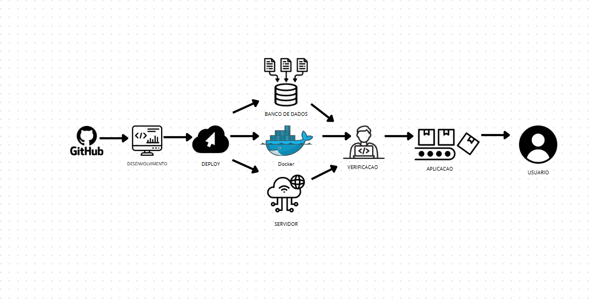
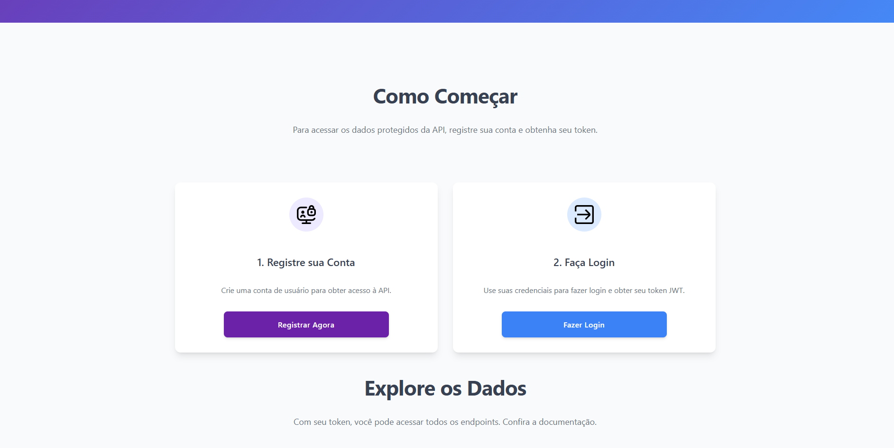

# API de Dados da Vitivinicultura Embrapa (TechChallenge)

API RESTful do projeto TechChallenge [FIAP - Pós Graduação em Software Architecture] para consulta de dados de vitivinicultura da Embrapa, com persistência em PostgreSQL e autenticação JWT.

**Link da API Deployada:** [https://techchallenger.onrender.com](https://techchallenger.onrender.com)

## 📝 Visão Geral

Este projeto fornece acesso aos dados públicos da Embrapa Vitibrasil sobre produção, processamento, comercialização, importação e exportação no setor vitivinícola. A API, desenvolvida em Python com FastAPI, armazena os dados raspados e informações de usuários em um banco PostgreSQL, servindo como base para futuros modelos de Machine Learning.

### Interface e Documentação
A API possui uma página inicial e documentação interativa:
* **Página Inicial:** [https://techchallenger.onrender.com](https://techchallenger.onrender.com)
  
* **Documentação (Swagger UI):** [https://techchallenger.onrender.com/docs](https://techchallenger.onrender.com/docs)
* **Documentação (ReDoc):** [https://techchallenger.onrender.com/redoc](https://techchallenger.onrender.com/redoc)

## ✨ Funcionalidades Principais

* Cadastro e login de usuários com token JWT.
* Endpoints protegidos para consulta de dados da Embrapa (Produção, Processamento, Comercialização, Importação, Exportação) por ano e tipo, lidos do banco de dados.
* Persistência de dados em PostgreSQL.
* Script para população inicial do banco de dados.
* Conteinerização com Docker e deploy no Render.com.
* Página inicial HTML/CSS.

## 💻 Tecnologias

Python 3.13, FastAPI, Uvicorn, Gunicorn, PostgreSQL, SQLAlchemy, Pydantic, JWT (`python-jose`), `hashlib.sha256`, Requests, BeautifulSoup4, `python-decouple`, Docker, Render.com, Jinja2, Tailwind CSS (CDN).

## 🏗️ Arquitetura e Deploy

A aplicação é conteinerizada com Docker e deployada no Render.com, integrando-se com GitHub para CI/CD. Os dados são persistidos em PostgreSQL.

## 🌐 Tela Inicial

## 🚀 Setup Local Rápido

1.  **Clone:** `git clone https://github.com/GuilhermeHJeronimo/TechChallenger.git && cd TechChallenger`
2.  **Ambiente Virtual:** `source venv/bin/activate`
3.  **Dependências:** `pip install -r requirements.txt`
4.  **Arquivo `.env`:** Crie na raiz com `DATABASE_URL` (ex: `sqlite:///./sql_app_local.db` ou sua string externa do Render) e `SECRET_KEY`.
5.  **Servidor:** `uvicorn app.main:app --reload` (Acesso: `http://127.0.0.1:8000`)

## 🐳 Docker Local
1.  **Build:** `docker build -t techchallenger-api .`
2.  **Run:** `docker run -p 8000:8000 -e DATABASE_URL="sqlite:////app/sql_app_docker.db" -e SECRET_KEY="docker_secret" techchallenger-api`

## 🗺️ Endpoints Principais (Autenticados)

Todos requerem `Authorization: Bearer <token>` e o parâmetro `ano`. Detalhes em `/docs`.

* **Autenticação:**
    * `POST /api/v1/auth/register` (Form data: `username`, `password`, `full_name` opcional)
    * `POST /api/v1/auth/token` (Form data: `username`, `password`)
* **Dados:**
    * `/api/v1/producao/?ano={ano}`
    * `/api/v1/comercializacao/?ano={ano}`
    * `/api/v1/processamento/{tipo}/?ano={ano}`
    * `/api/v1/importacao/{tipo}/?ano={ano}`
    * `/api/v1/exportacao/{tipo}/?ano={ano}`

## 🔮 Próximos Passos
* Configurar Cron Job no Render para coleta agendada de dados.
* Criar coleção Postman.
* Aprimorar segurança da autenticação (bcrypt, expiração de token).
* Adicionar testes automatizados e caching.
* Desenvolver modelo de Machine Learning.

## 👤 Autor
* **Guilherme H. Jeronimo**
* **GitHub:** [GuilhermeHJeronimo](https://github.com/GuilhermeHJeronimo)